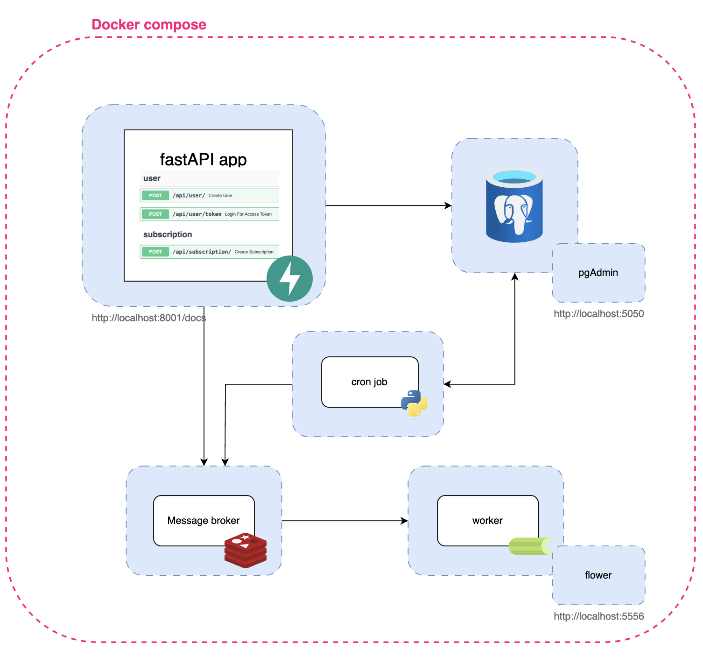
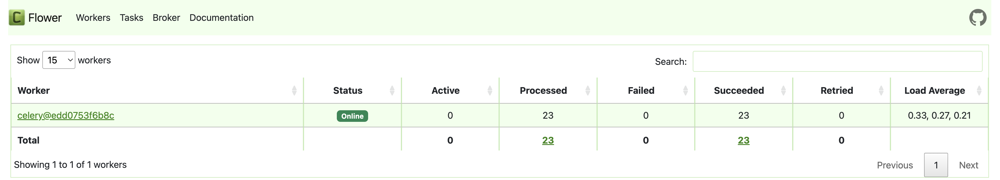

# General description

## High-level design

# Intructions

1. **Build and Launch:**
   - Build and launch the Docker Compose file.

2. **Access OpenAPI Documentation:**
   - Visit [http://localhost:8001/docs](http://localhost:8001/docs) to explore the OpenAPI documentation, which includes examples ready to use.

3. **Create a User:**
   - Use the `POST` method on `api/user` to create a user. Refer to the provided example for guidance.

4. **Add a Subscription:**
   - Authenticate yourself by clicking the lock icon.
   - Use the `POST` method on `api/subscription` to add a subscription.
  
5. **Access the Flower Dashboard:**
   
   
   
   - Visit [http://localhost:5556](http://localhost:5556) to access the Flower dashboard. Here, you can monitor the status of the worker and the state of the events a.k.a. tasks (push notifications).
  

